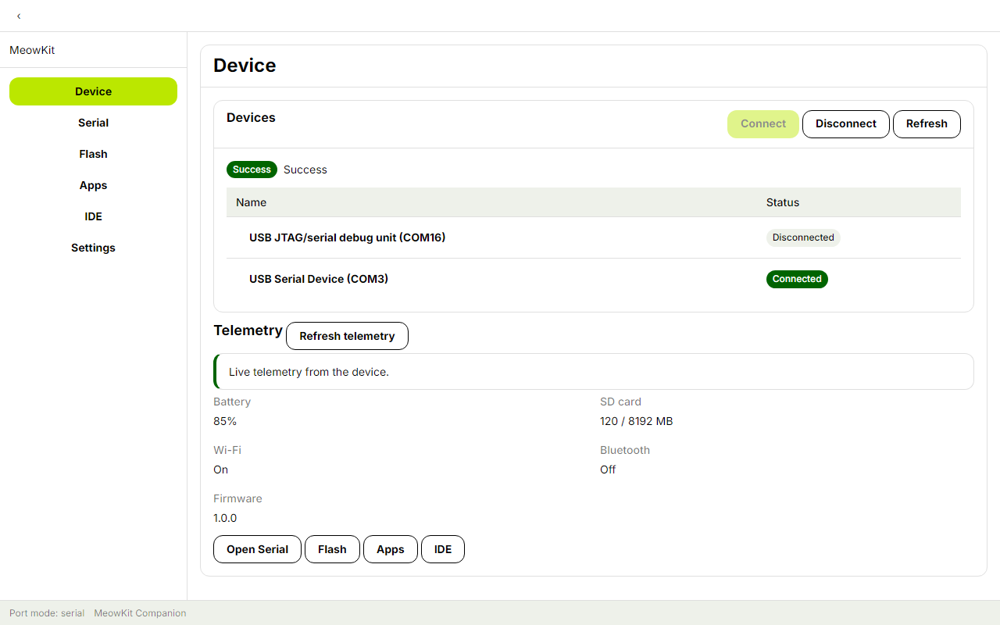
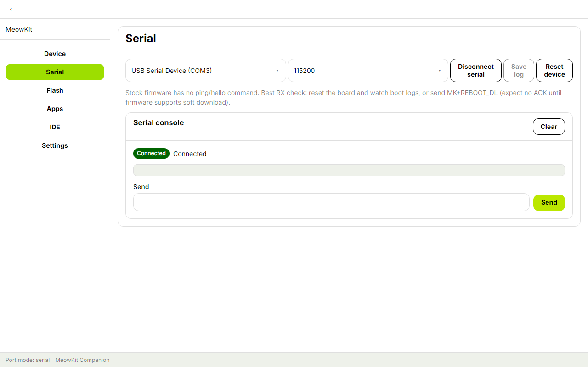
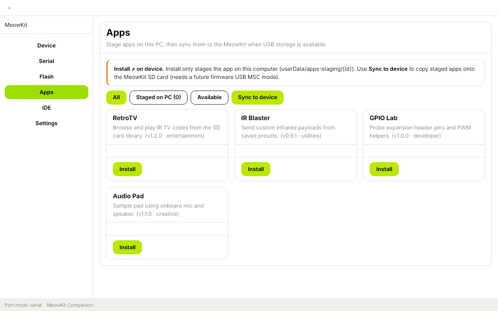
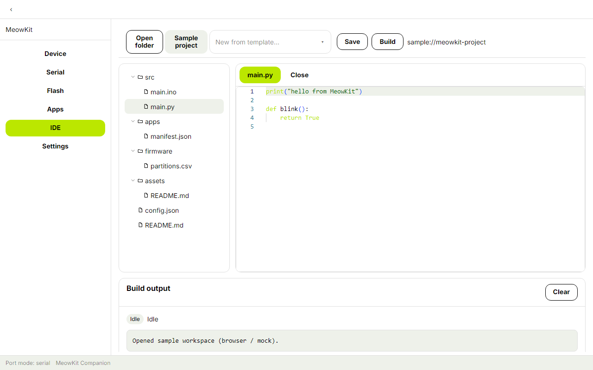

# MeowKit Companion

MeowKit Companion is an **unofficial, community-developed desktop companion** for MeowKit ESP32-S3 devices. It is not affiliated with, endorsed by, or supported by the MeowKit team.

The app provides USB serial access, firmware flashing, local app staging, and an IDE-style workspace. Device features depend on the connected hardware and firmware; see the current capabilities below before use.

## Screenshots

| Device | Serial |
| --- | --- |
|  |  |

| Apps | IDE |
| --- | --- |
|  |  |

## Current capabilities

- **Device and serial:** USB port discovery, serial console, baud-rate selection, log saving, and connection controls.
- **Firmware:** bundled factory firmware and user-selected `.bin` images, with progress and logs. The stock firmware requires manual BOOT-button entry into download mode. Custom image layout is the user's responsibility.
- **Apps:** browse the offline catalog and stage app files on the computer. Installing to the device requires USB mass storage support.
- **IDE:** browse and edit workspace files with Monaco. Build support depends on the configured toolchain and is currently limited; some configurations provide dry-run output.
- **Settings:** serial defaults, toolchain configuration, and recent projects.

The app and its supported workflows are under active community development. Verify compatibility with your device and firmware before relying on a feature.

## Requirements

- Windows, macOS, or Linux
- Node.js 20 or newer
- pnpm 9
- A MeowKit device and USB data cable for hardware features

## Development setup

From the repository root, clone the UI component library and install dependencies:

```bash
git clone https://github.com/pve-homelab/MeowKit-React-Library.git vendor/MeowKit-React-Library
npx pnpm@9.15.0 install
npx pnpm@9.15.0 --filter @meowkit/components... build
npx pnpm@9.15.0 fetch-firmware
```

Run the browser preview (mock device bridge):

```bash
npx pnpm@9.15.0 dev:web
```

Run the desktop app:

```bash
npx pnpm@9.15.0 dev
```

## Available commands

| Command | Description |
| --- | --- |
| `pnpm dev` | Start the Electron development app |
| `pnpm dev:web` | Start the browser preview using a mock device bridge |
| `pnpm test` | Run the unit test suite |
| `pnpm typecheck` | Check TypeScript types |
| `pnpm fetch-firmware` | Fetch the bundled factory firmware resource |
| `pnpm dist` | Build a Windows installer |

## Hardware notes

- Use a USB data cable. Close other serial monitors before connecting or flashing.
- Serial and flashing share the device's USB port; the app releases the serial connection before flashing.
- Stock firmware does not support software entry to download mode. Follow the in-app BOOT-button instructions when flashing.
- The erase option affects internal flash and NVS; it does not erase the microSD card.
- Custom firmware images are written at address `0x0`. Confirm the image format and flash layout before use.

## Project status and support

This is a community project. When issue tracking is enabled, report reproducible problems in the hosting repository. Include your operating system, device model, firmware version, and the steps that led to the problem. Do not include private logs or device data without reviewing them first.

## References

- [MeowKit website](https://meowkit.cc/)
- [MeowKit documentation](https://docs.meowkit.cc/)
- [MeowKit firmware](https://github.com/mingolucky/meowkit-s3-firmware)
- [MeowKit React Library](https://github.com/pve-homelab/MeowKit-React-Library)
